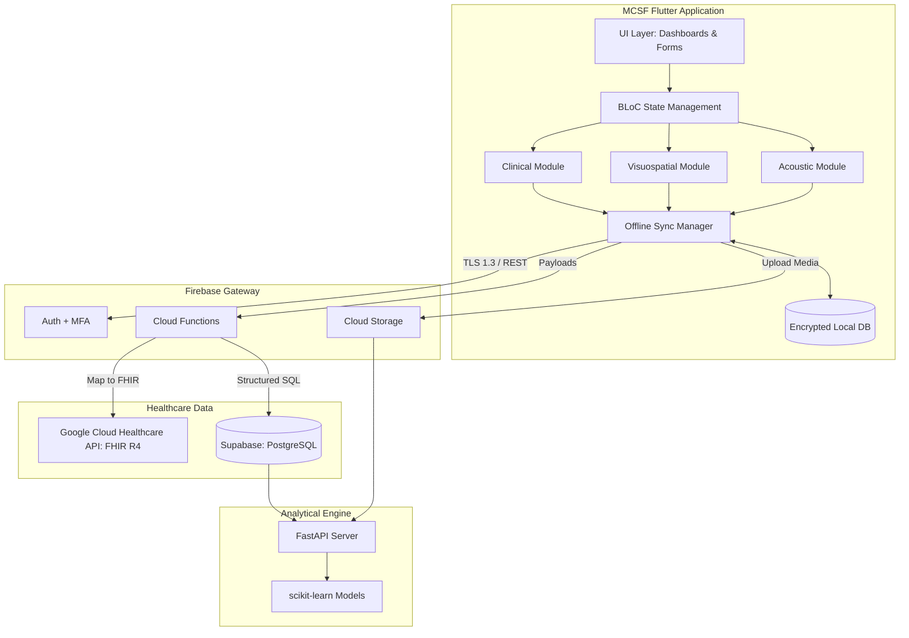

# MCSF Architecture Overview

## 1. High-Level Design
The Multimodal Cognitive Screening Framework (MCSF) is built on a **Late-Fusion Modular Architecture**. This design decouples the acquisition and preliminary processing of distinct biomarker modalities (clinical, visuospatial, acoustic) allowing them to operate autonomously before their outputs are merged into a unified analytical feature matrix.

### 1.1 Flutter Client (Frontend)
*   **Framework**: Flutter 3.x (Dart 3.x)
*   **State Management**: BLoC (Business Logic Component) pattern.
*   **Routing**: GoRouter for declarative, path-based routing.
*   **Local Storage**: 
    *   `Hive`: Encrypted NoSQL key-value store for app state and session caching.
    *   `Drift` (SQLite): Relational database for structured, offline-first querying.
    *   `flutter_secure_storage`: Secure enclave for cryptographic keys and sensitive tokens.

### 1.2 Backend Services
*   **Primary PaaS**: Firebase (Authentication via MFA, Cloud Functions for serverless logic, Cloud Storage for media assets like audio/drawings).
*   **Relational Database**: Supabase (PostgreSQL) enforcing Row-Level Security (RLS) for multi-tenant clinical/research isolation.
*   **Interoperability Layer**: Google Cloud Healthcare API acting as the FHIR R4 server.
*   **Analytical Engine**: Python FastAPI microservice utilizing `scikit-learn` (Random Forest, SVM, normative deviations).

## 2. Component Diagram

## 3. Data Flow & Late Fusion Architecture
1.  **Acquisition**: Modules independently capture data (e.g., Visuospatial captures arrays of `StrokePoint`, Acoustic captures `WAV` + metadata).
2.  **Transformation (Client-side)**: Initial feature extraction occurs on-device (e.g., mean stroke velocity, duration, pause count).
3.  **Local Storage**: Appended to the immutable audit log and encrypted local store.
4.  **Synchronization**: The `ConnectivityManager` pushes to Firebase/Supabase when online.
5.  **Aggregation**: The ML microservice polls Supabase for completed session records.
6.  **Fusion**: 
    *   `clinical_vec` + `visuospatial_vec` + `acoustic_vec` are concatenated into a single `feature_matrix`.
    *   RandomForest calculates probability/risk scores.
7.  **Feedback**: Results are written back to Supabase and synced to the Clinician Dashboard.

## 4. Security & Compliance (HIPAA, 21 CFR Part 11)
*   **Data at Rest**: SQLite encrypted via SQLCipher; Hive boxes encrypted with AES-256-GCM.
*   **Data in Transit**: Strict TLS 1.3 enforcement.
*   **Audit Trails**: Every module completion generates a cryptographic hash (`SHA-256`) of the payload and device metadata, forming an immutable chain.
*   **PHI Anonymization**: AI microservice processes only UUIDs; PHI (Names, CURP) is stripped by Cloud Functions before routing to analytical DBs.
